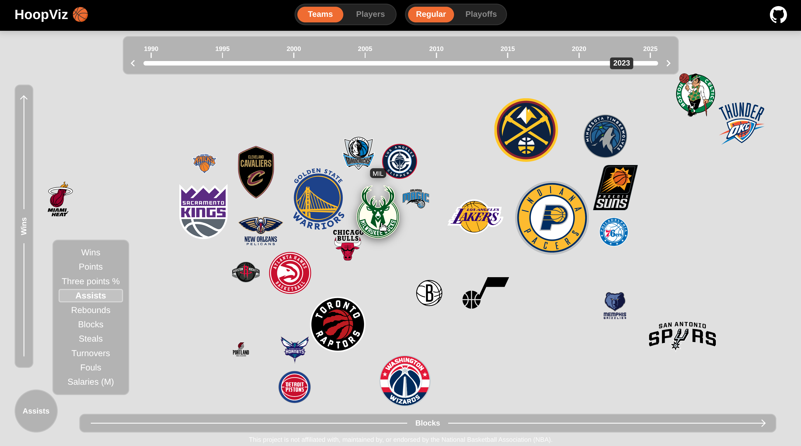
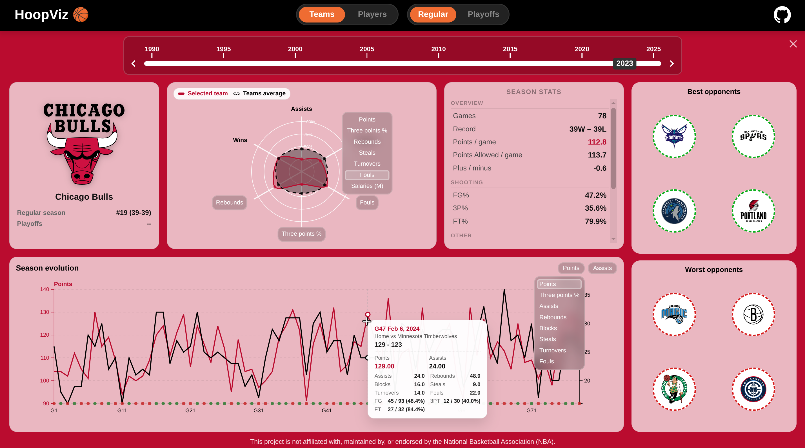
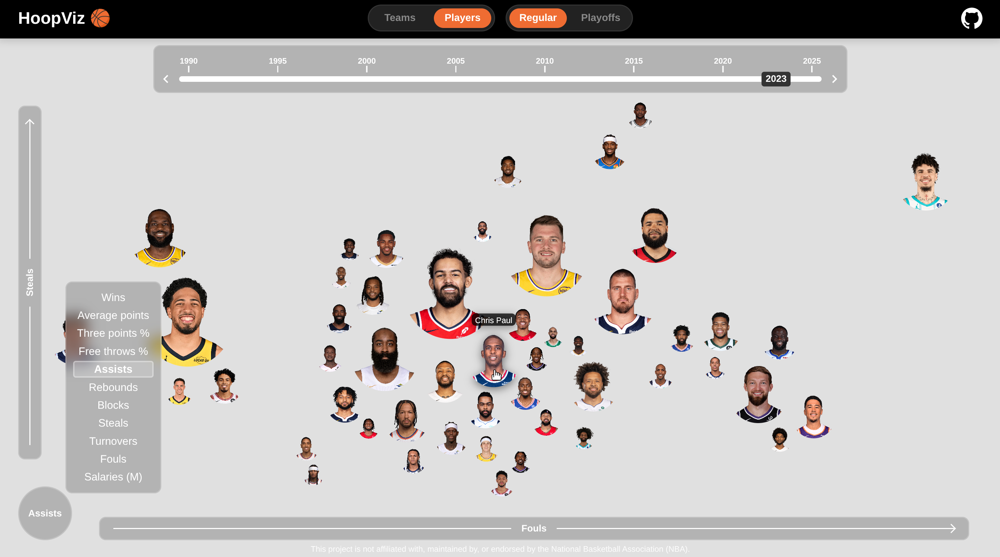
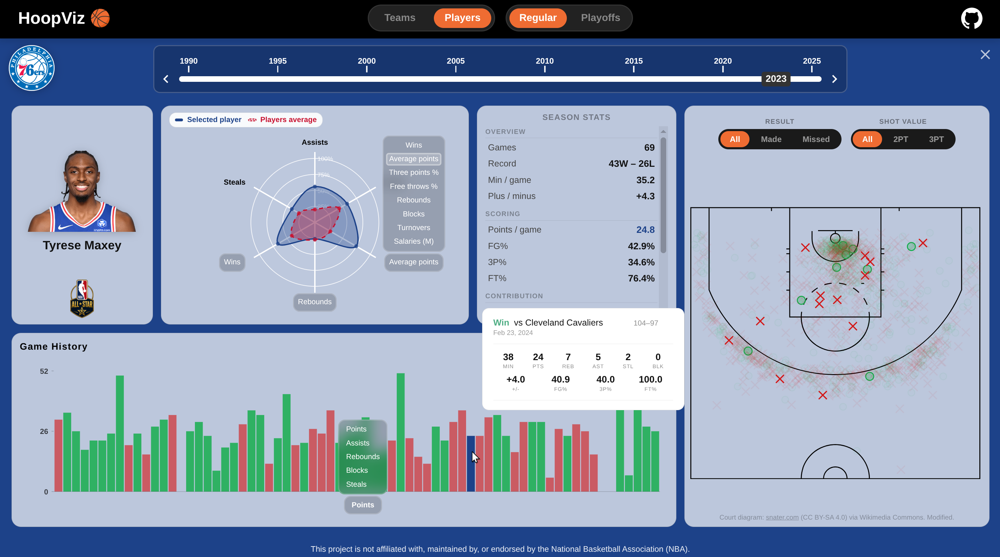

# HoopViz 🏀

HoopViz is an **interactive**, **web based**, **data visualization** project designed to turn decades of dry **NBA statistics** into a **dynamic**, **interactive** and **visual** story.
While most basketball statistics sites feel like looking at a tax return, we want our project to mirror the fast-paced and playful energy of the game itself.

By using multiple seasons of data, we are building a "time-traveling" experience where users can slide through history to see how the league has evolved over the years with interesting transitions.

**Live Website: <https://com-480-data-visualization.github.io/HoopViz/>** (use a chromium based desktop browser)

**Video Demo:** <https://youtu.be/H1Zgz_uHQyw>

## Deliverables

Project of Data Visualization (EPFL COM-480) - 2026

| Student's name | SCIPER |
| -------------- | ------ |
| Lucas Jung | 324724 |
| Anasse El Boudiri | 374212 |
| Sam Lee | 375535 |

- [Milestone 1](./deliverables/ms1/ms1.md)
- [Milestone 2](./deliverables/ms2/ms2.pdf)
- [Milestone 3](./deliverables/ms3/process_book.pdf)

**Note**: Each deliverable comes with its associated GitHub release of the repository.

## Usage

When landing on the website, the user is presented with a large scale map where all NBA teams are displayed.
The teams are positioned on this 2D space using three key metrics, seen on the axes overlay.
One metric dictates the position of the team on the X axis, another one on the Y axis, and the last metric dictates the size of the team.
Those three metrics are user customizable from a list of common interesting ones related to the sport, and they are randomly assigned on page load in order to see a different take on the stats on every visit!
To change a metric, the user can click on any of the three axes and select one they would like from the dropdown that appears.
All the teams will then re-organize based on this new metric choice, with animated transitions.



Additionally, at the top of the map, the user can interact with a seasons/year slider.
They can either drag and drop the slider's handle, or use their keyboard's left and right arrow keys, to transition from year to year.
They could also just click anywhere on the slider to jump directly to that year.
This will trigger the teams to re-arrange to match the selected metrics according that new target year, allowing visualization of the data through time.
The animated transitions are particularly useful there because we can follow teams that improved or worsen year by year.

The user can also click on any team of their choice to open a specialized dashboard for that team, revealing key insights and additional visualizations, tailored to that team and to the currently selected year.
On that page, the user can notably see a radar chart visualization displaying some important normalized metrics about their performance.
The three metrics at the top are fixed to the same ones that were used to position them on the map, and all the other ones are again fully user customizable by clicking on them and selecting a particular one of interest from the dropdown.
Many other graphs and interesting visualizations are displayed on that team dashboard page: general season stats, best and worst opponents, and a game-by-game line chart with customizable axes showing the evolution of two chosen metrics for each game of the season.
Don't hesitate to hover over those visualizations as it will reveal even more detailed data about the specific info you're hovering over!
Of course, on that team dashboard page the same year slider at the top is still working, and the user can browse the dashboard's data through time as well, with animated transitions.



At the very top of the website there is a selector to chose between two types of map.
By default it is that NBA teams map visualization that we see, but we also offer to view a map of the individual NBA players by clicking on that "Players" button.



The players map has the same features as the teams map, and clicking on any player will also open their dedicated dashboard page.
On this page we can find the same radar chart with customizable metrics selection.
Additionally, this page showcases a shot map where each shot the player attempted during their games that year is overlaid on the court diagram.
Each shot is displayed as a green circle if it scored points, or as a red cross if it didn't.
That allows for seeing where the player is the most comfortable shooting positions and if they have a side or area where they tend to make shots more often than not.
The user can use the available filters on top of this chart to only show three pointers or only shots that missed for example.
There is a shared interactivity between the shot map visualization and the game history chart to its left: when you hover over a shot position, or over a game in the game history, the visualization will filter to only show you shots from that particular game, and it will display a nice information window with additional data about the game!



## Development setup

If you want to run the website locally it's very simple. The whole website is static so you can clone the repository and run an HTTP server in the `src` folder. There is no build step.

```bash
git clone https://github.com/com-480-data-visualization/HoopViz
cd HoopViz/src
python -m http.server
```

## Repository structure

- `data`: everything related to our dataset with instructions to reproduce it.
- `deliverables`: deliverables for the EPFL COM-480 course.
- `scripts`: code we wrote to explore the data or pre-process it.
- `src`: code for the visualization website.

We opted for a minimal but powerful technical stack.
We mostly relied on vanilla HTML CSS and JavaScript, creating a static website, with no build step, making it very easy to code and deploy.

Our website's entry file is `src/index.html` which is very readable and styled using proper CSS class names.
We then load JavaScript from our single main entry point at `src/js/main.js`.
We utilized the [D3.js](https://d3js.org/) library for some of our visualizations.
Our JavaScript code is properly modularized in the `src/js` directory to keep a proper separation of concerns and improve development collaboration.
Finally we kept all data as plain `.csv` files, per-generated from our Python scripts, that we serve from the `src/data` directory.

The whole website is automatically deployed to GitHub pages hosting (via CI/CD) when pushing/merging to the `main` branch.
We designed the website as a Single Page Application ([SPA](https://en.wikipedia.org/wiki/Single-page_application)) in order to bring a smooth experience to the user and avoid page transition load times.
